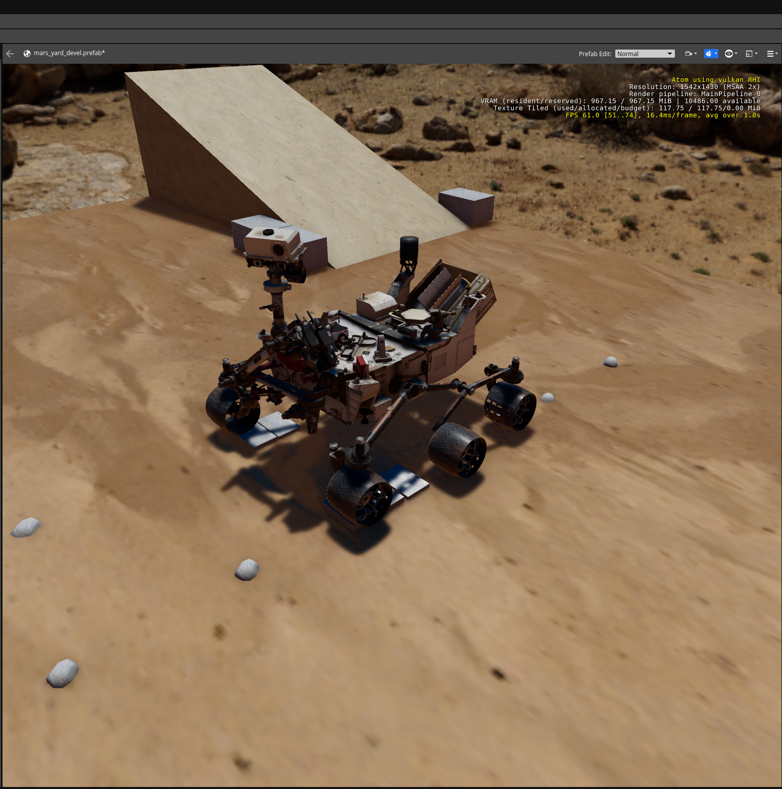

[![Apache License, Version 2.0][apache_shield]][apache]

# Nasa Curiosity Rover Gem for Open 3D Engine (O3DE)

Author: Azmyin Md. Kamal
Date: 09/09/2024
Version 1.0
Created as part of submission to the NASA Space ROS Sim Summer Sprint Challenge 2024, Issue [#181](https://github.com/space-ros/docker/issues/181)

## Description

This is an Asset Gem. It is a port of the NASA's Curiosity Rover model from [Space-ROS simulation](https://github.com/space-ros/simulation/tree/main/models/curiosity_path) repository. 

## Requirements

* Any O3DE project with the [ROS 2 Gem](https://docs.o3de.org/docs/user-guide/interactivity/robotics/) enabled. 
* An example of using this gem can be found here: https://github.com/Mechazo11/O3DE_CURIOSITY_ROVER_SIM

## Installation

Checkout the Docker scrpit in [o3de_nasa_rover](https://github.com/Mechazo11/o3de_nasa_rover) repository for a guide on how to install this gem in a O3DE project.

## Prefab

* ```curiosity_rover.prefab```: An O3DE prefab that brings together the various entire NASA Curiosity Rover robot into O3DE. One of the chassis ```.dae``` asset had a meshing error. This was corrected before creating this Prefab using Blender.

## Screenshots

<p align="left">
  
</p>

## Status

Project is not longer maintained. However if you have any questions, concerns or comments, please don't hesitate to reaching out to me. My contact information is available here: https://mechazo11.github.io/

## Acknowledgments
This work is licensed under [Apache License, Version 2.0][apache]. You may elect at your option to use the [MIT License][mit] instead. Contributions must be made under both licenses.

[apache]: https://opensource.org/licenses/Apache-2.0
[mit]: https://opensource.org/licenses/MIT
[apache_shield]: https://img.shields.io/badge/License-Apache_2.0-blue.svg